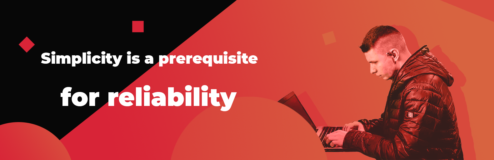

## Hi everyone, my name is Ilya and I'm a Front-end Developer from Ukraine.

:computer: Currently working on something cool and always ready to take on challenging tasks!

:sunglasses: I'm into complex UI systems with a lot of data, beautiful interfaces, and the latest trends and cutting-edge tech like micro frontend.

:thumbsup: My main tech stack is React.js, React Native, Gatsby.js, and TypeScript.

### My latest projects:

https://decision.ai/ - the complex AI-powered data science risk management system. Worked on website, and platform frontend.

https://mobilecoach.com/ - the enterprise-grade chatbot platform. Worked on the interface of the app as a front-end developer for the last 3 years.

http://atomic.vc/ - the adaptive website for a venture fund that founds companies made on Gatsby.js

### My code samples:

https://gist.github.com/sweatC/7fee1eeff3a12d90dca6c017b108a8cd

https://gist.github.com/sweatC/3943f14e0fcdd5de5775d8345c3bc393

https://gist.github.com/sweatC/b2bd24fcd13227e3afdfa9e7a74e0571

https://gist.github.com/sweatC/2b1644e0c146b0e5432362e8a3308fab
